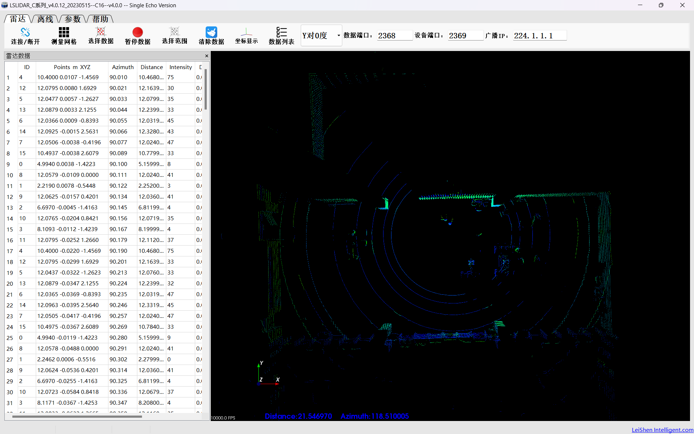
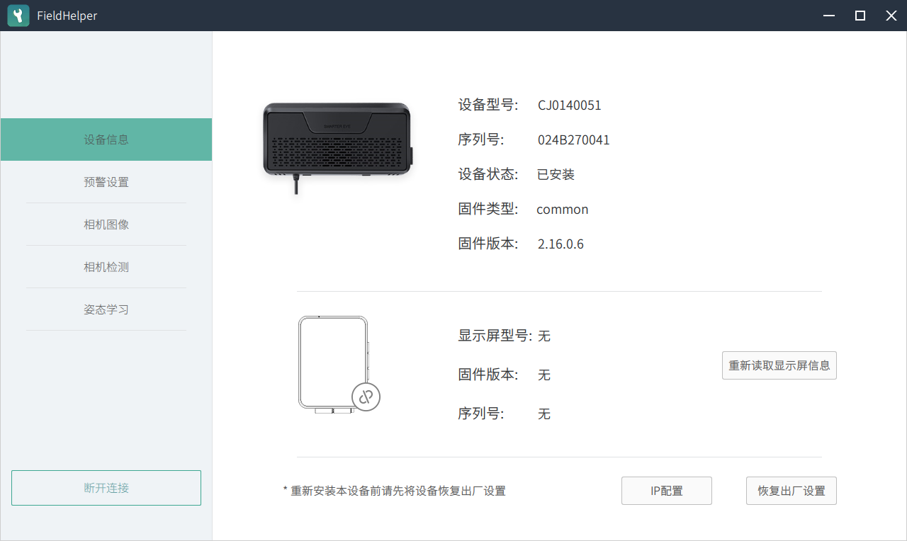
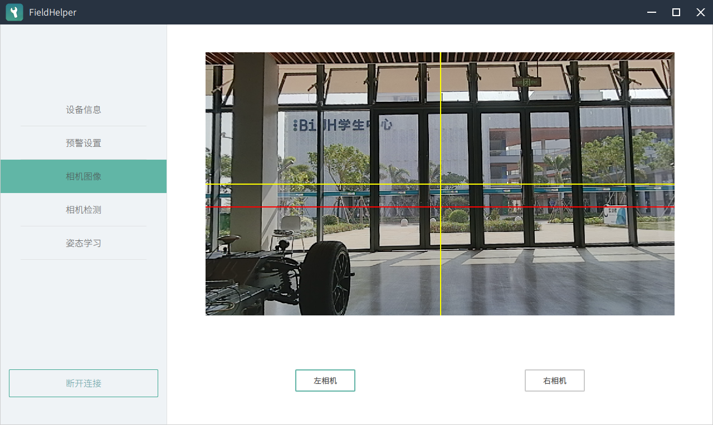
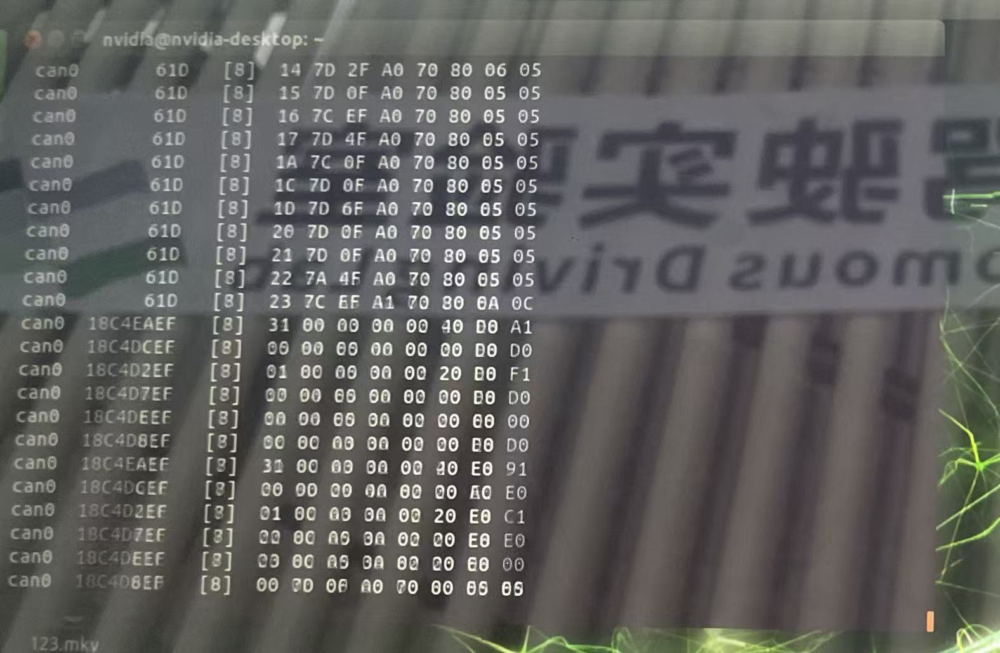
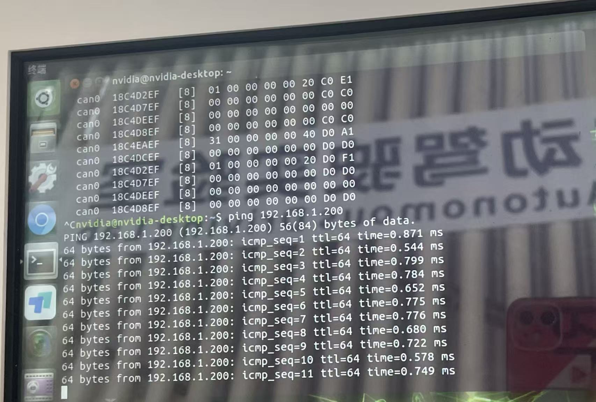
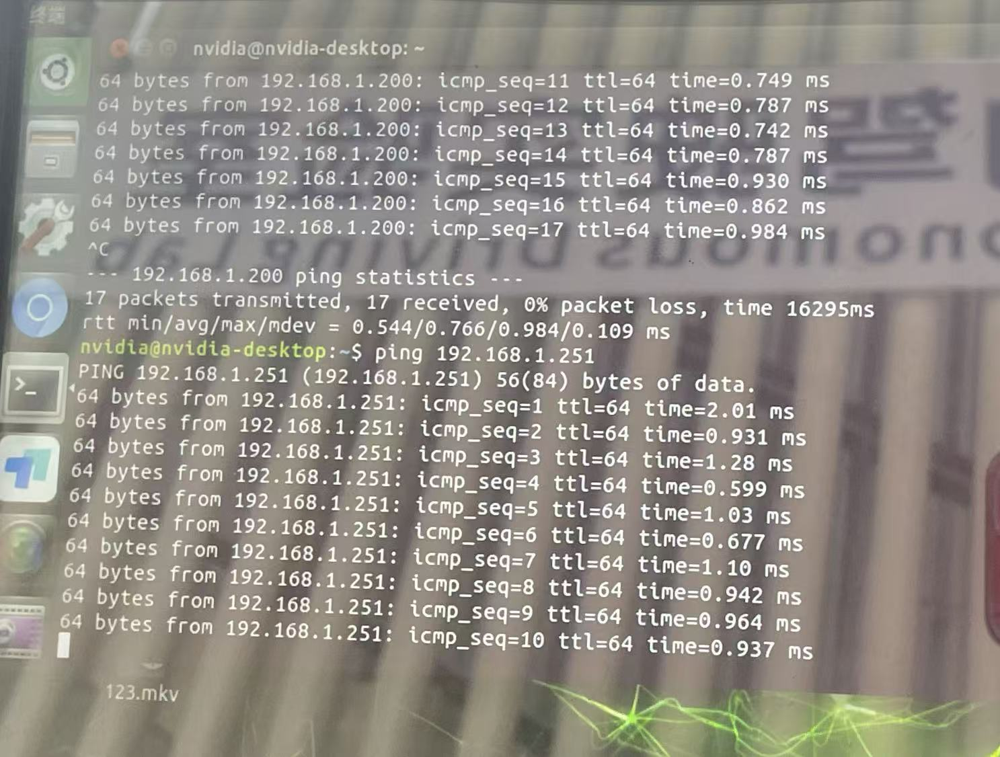

# **Week6 实验报告**
***
## **一、实验任务**
- 掌握硬件链路验证方法
- 熟练使用传感器上位机
- 完成双目相机标定流程
- 具备 Apollo 模块与数据流监控能力

***

## **二、实现过程**

### **1. Windows 上位机对于激光雷达和双目相机初步检测**

1. 准备工作

下载上位机，关闭Windows防火墙，并且通过网线连接小车，期间保持小车Ubuntu系统关闭

在Windows当中配置IP地址和IPv4地址

2. 打开 LSLIDAR 上位机

点击右上角连接后，通过鼠标调整激光雷达角度


可覆盖360° 环境， 环境十分稳定

3. 双目相机和设备连接

在上位机中离线登录，输入IP地址连接设备


确认相机视野


***

### **2. 传感器健康度巡检**

1. CAN 总线检测

```
candump can0
```
检测CAN总线

如图可见终端有持续跳动的数据帧

2. 网络连通性检测

通过ping 192.168.1.200检测激光雷达


通过ping 192.168.1.251检测双目相机
